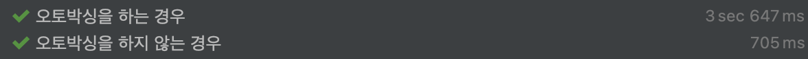

# 불필요한 객체 생성을 피하라

### 핵심

- 똑같은 기능의 객체를 매번 생성하기보다는 객체 하나를 재사용하는 편이 낫다.

```java
static boolean isRomanNumeral(String str) {
    return str.matches("^(?=.)M*(C[MD]|D?C{0,3})(X[CL]|L?X{0,3})(I[XV]|V?I{0,3})$");
}

// 해당 코드를 타고타고 들어가보면 다음과 같이 Pattern 인스턴스가 새롭게 생성되는 것을 알 수 있음.

public static Pattern compile(String regex) {
    return new Pattern(regex, 0);
}
```

Strings.matches 메서드는 사용할 때 마다 Pattern 객체를 새롭게 생성한다. 한 번 쓰이고 바로 버려져서 GC의 대상이 되는데,

자주 사용한다면 성능의 누수를 일으킬 수 있다.

성능 개선을 위해 Pattern 인스턴스를 캐싱, 혹은 상수로 두고 재사용 하는 것이 낫다.

```java
public class RomanNumber {
    private static final Pattern ROMAN = Pattern.compile("^(?=.)M*(C[MD]|D?C{0,3})(X[CL]|L?X{0,3})(I[XV]|V?I{0,3})$");

    static boolean isRomanNumeral(String str) {
        return ROMAN.matcher(str).matches();
	}
}
```

## 오토 박싱을 사용할 때 주의하라

오토 박싱은 기본 타입과 박싱 된 기본 타입을 자동으로 변환해준다.

이를 잘못 사용하게 될 경우, 불필요한 메모리 할당이 반복되어 성능이 나빠진다.

```java
void autoBoxing_Test() {
    Long sum = 0L;
    for(long i = 0; i <= Integer.MAX_VALUE; i++) {
        sum += i;
    }
}

void noneBoxing_Test() {
    long sum = 0L;
    for(long i = 0; i < Integer.MAX_VALUE; i++) {
        sum += i;
    }
}
```



출처 : https://github.com/woowacourse-study/2022-effective-java