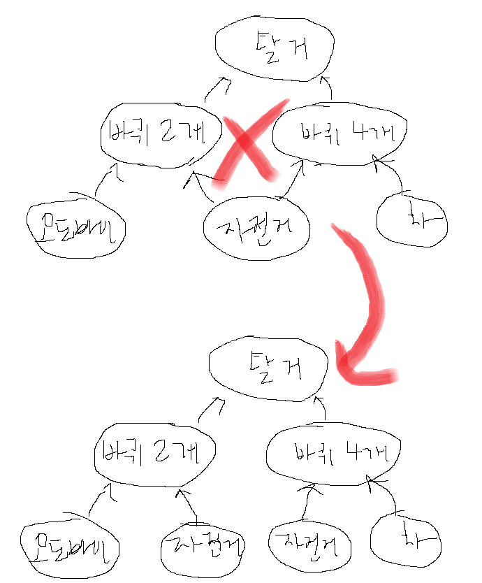

# 추상 클래스보다는 인터페이스를 우선하라

> 추상 클래스: 설계도 
>
> 인터페이스: 규칙

&nbsp; 예를 들어 *전진, 정지, 방향 전환* 기능이 있는 자동차 설계도를 구현하면, 이 구현 객체는 무조건 자동차가 됨.(추클)

&nbsp; *전진, 정지, 방향 전환* 즉, 운행 가능한 규칙을 구현하면, 이 구현 객체는 운행 가능한 비행기, 자전거 등 운행하는 무언가가 될 수 있음.


### 인터페이스 장점
- 자동차가 아니어도 됨
- 날 수 있는, 전기로 가는 등 새로운 규칙을 추가하기 용이함.

   > 참고로 그래서 인터페이스 명명 규칙 중 able이 좋다는 거 어디서 본 듯

### 추상 클래스 단점
- 다중 상속 불가로 클래스 계층구조 박살 남
<br>


## 단점 보완하고 장점 잘 써먹기
> [템플릿 메서드 패턴](#Template-Method-Pattern)


### 1. [Item 18](../item-18/README.md)
- is-a 말고 has-a 쓰기 (책에서 컴포지션, 래퍼 클래스라고 함)

### 2. Default method로 일감 줄이기
- java 8부터 제공되는 기능 (인터페이스에서 메서드 구현 가능)
- Override 하면 위험하니까 @implSeq 태그 붙여서 자바독으로 명시([문서화](../item-19/README.md)) 
- Object 메서드 이름 사용 금지

   > <!!!!!> 애초에 다중 상속 안되는 이유(다이아몬드 문제) 생각해서 알아서 신중하게 써야 함<br>
   > 정 어려우면 추상 골격 구현 클래스 ㄱㄱ

  
### 3. 추상 골격 구현 클래스

- 인터페이스를 구현한 추상 클래스에 실제 구현하고, 유연성을 가질 수 있는 메서드는 추상 메서드로 남겨두는 거임 <br> 
(default method 써도 [문제](https://github.com/eeeffective-java-study/effective-java/issues/21)없을 거 같으면 추상 골격 구현 클래스 ㄴㄴ)
- 관례상 대상 인터페이스 이름 앞에 Abstract-를 접두어로 붙임
- 우회적으로 이용 가능 ([시뮬레이트한 다중 상속](https://github.com/eeeffective-java-study/effective-java/issues/20))
  - 내부에 추상 골격 구현 클래스를 상속한 inner class를 정의해서 사용(private)
  - [item 18](../item-18/README.md)이랑 비슷한데 필드 말고, inner class로 하는 거임
- ex.
    ```java
    
    public abstract class AbstractList<E> extends AbstractCollection<E> implements List<E> {
    
        public abstract E get(int index);
    
        public E set(int index, E element) {
            throw new UnsupportedOperationException();
        }
    
        private class Itr implements Iterator<E> {
    
            public E next() {
                checkForComodification();
                try {
                    int i = cursor;
                    E next = get(i); //get()의 구현을 하위 클래스에게 맡기고 내부적으로 사용함.
                    lastRet = i;
                    cursor = i + 1;
                    return next;
                } catch (IndexOutOfBoundsException e) {
                    checkForComodification();
                    throw new NoSuchElementException(e);
                }
            }
        }
    }
    
    ```

## 결론: 인터페이스 우선으로 사용하기
1. 다른 메서드에서 사용되는 기반 메서드를 선정 (**추상 메서드 대상 선정**)
   - 해당 인터페이스를 구현한 하위 타입마다 변경 사항이 있는 메서드
2. 구현 가능한 메서드 **Default 메서드**로 작성
   - @implSeq 태그로 문서화
   - Object 관련 메서드 제공 X
3. 애매한 메서드가 남았다? Abstract 붙인 추상 클래스(골격 구현 클래스)에서 작성
   - 머 추가적인 사항 잘 해결하길,,
   > 참고로 이때, abstract class가 아닌 일반 클래스로 만들면 **단순 구현**이라고 함.<br>
   > ex. (축약한 거)
   > ```java
   > public static class SimpleEntry<K,V> implements Entry<K,V>, java.io.Serializable {
   >     private final K key;
   >     private V value;
   > 
   >     public K getKey() { return key; }
   >     public V getValue() { return value; }
   > 
   >     public boolean equals(Object o) {
   >         return o instanceof Map.Entry<?, ?> e
   >                 && eq(key, e.getKey())
   >                 && eq(value, e.getValue());
   >     }
   >     public String toString() {
   >         return key + "=" + value;
   >    }
   > }
   > ```  


## 참고

### Template Method Pattern
> 기반 메서드: 섬세한 조작<br>
> 기반 메서드를 사용해 직접 구현할 수 있는 메서드(template method): 복잡한데 공통되는 로직

```java
interface 이동_가능한 {
    
    protected float 방향_전환(); // 기반 메서드
    
    default void 전진() {
        // 방향_전환에 따라 모터 속도나 진행 속도를 조작하는 로직
    }
}
```
이게 템플릿 클래스임. 이제 방향_전환() 메서드를 Override 해주면, 전진() 함수가 예상대로 동작함

```java
class 자동차 extends 이동_가능한 {

    @Override
    protected abstract float 방향_전환() {
        return 핸들_돌린_정도_계산_결과;
    }

}
        
class 스키 extends 이동_가능한 {

    @Override
    protected abstract float 방향_전환() {
        return 몸둥아리_꺽은_정도_계산_결과;
    }
    
}
```
아무래도 일감이 많이 줄엇음,,
```java
public class Main {
    public static void main(String[] args) {
        이동_가능한 car = new 자동차();
        이동_가능한 ski = new 스키();
        
        car.전진();
        ski.전진(); // 전진 함수 구현 안해도 잘 돌아감
    }    
}

```

사실 이 경우는, 모터 속도 제한 등을 가지고 있어야 하기 때문에 골격 추상 클래스가 더 괜찮지 않았을까,, 합니다..