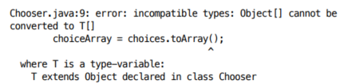

# 배열보다는 리스트를 사용하라

배열은 공변, 제네릭은 불공변이다.

공변이란 즉, Sub가 Super의 하위 타입이라면 Sub[] 또한 Super[]의 하위 타입이라는 뜻이다.

```java
public static void main(String[] args) {
    // Long은 Object의 하위 타입이기 때문에 배열 또한 마찬가지로 공변.
    // 즉, 컴파일 에러가 일어나지 않는다.
    Object[] objectArray = new Long[1];
    
    // 런타임 시점에 ArrayStoreException 에러 발생!
    objectArray[0] = "타입이 맞지않아 넣을 수 없다.";
}
```

```java
import java.util.ArrayList;

public static void main(String[] args) {
    // 컴파일 에러 발생!
    List<Object> ol = new ArrayList<Long>();

    ol.add("타입이 달라 넣을 수 없다.");
}
```

#### 배열에서는 런타임에서 알게되는 실수를 리스트를 사용하면 컴파일 때 에러를 알 수 있음.

배열은 런타임에도 자신이 담기로 한 원소의 타입을 인지하고 확인한다.

반면 제네릭은 타입 정보가 런타임에는 소거되기 때문에, 원소 타입을 컴파일 시점에서만 검사한다.

이런 차이점들 때문에 배열과 제네릭은 잘 어우러지지 못함.

그래서 제네릭 배열도 생성 불가함.(타입 안전성 때문)

```java
// 원래 불가능한 코드지만 허용 된다고 가정
List<String>[] stringLists = new List<String>[1];
List<Integer> intList = List.of(42);
// 배열은 공변 가능. String이 Object의 하위 타입이기 때문에 배열도 마찬가지
Object[] objects = stringLists;
// 제네릭은 소거 방식으로 구현되기 때문에, 이 역시 성공함. 즉, 런타임 시점 까지 에러가 없음
Objects[0] = intList;
// 컴파일러는 get(0)으로 꺼낸 원소를 Sring으로 형변환 하는데, 이 원소는 Integer이기 때문에 ClassCastException 발생!
String s = StringLists[0].get(0);
```

### 실체화 불가 타입
- **E, List<E>, List<String> 같은 타입을 실체화 불가 타입** 이라고 한다.
- 실체화되지 않기 때문에 런타임에는 컴파일타임보다 타입 정보를 적게 가지는 타입이다.
  
여기서 주목할 점은 List<String>도 실체화 불가 타입으로 분류된다는 것임. 

이는 Java의 제네릭 구현 방식인 타입 소거(type erasure) 때문.

### 타입 소거로 인해:
- List<String>은 런타임에 단순히 List가 됨.
- List<String>과 List<Integer>는 런타임에 구분할 수 없음.
- 따라서 List<String>은 실체화 불가 타입임. 컴파일 시에는 타입 정보가 있지만, 런타임에는 이 정보가 소거되기 때문.

```java
public class Chooser<T> {
    private final T[] choiceArray;
    
    public Chooser(Collection<T> choices) {
        choiceArray = (T[]) choice.toArray();
    }
}
```



- 위의 코드에서 컴파일 경고가 생기는 이유는 원소의 타입 정보가 소거되어, 런타임에는 무슨 타입인지 알 수 없기 때문이다.
- 다만, 설계 상 해당 코드에서 런타임 에러가 발생할 수 없기 때문에 SuppressWarnings 에너테이션을 통해 경고를 제거해 줄 수 있다.

```java
public class Chooser<T> {
    private final List<T> choiceList;
    
    public Chooser(Collection<T> choices) {
        choiceList = new ArrayList<>(choices);
    }
    
    public T choose() {
        Random rnd = ThreadLocalRandom.current();
        return choiceList.get(rnd.nextInt(choiceList.size()));
    }
}
```

- 하지만 애초에 경고의 원인을 제거 하는 편이 훨씬 낫다.
- 쓸데없는 타입 캐스팅이 사라지고 코드를 더 깔끔하고 읽기 쉽게 만든다.

